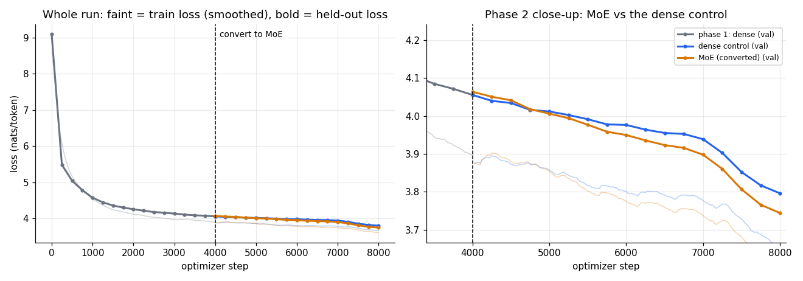
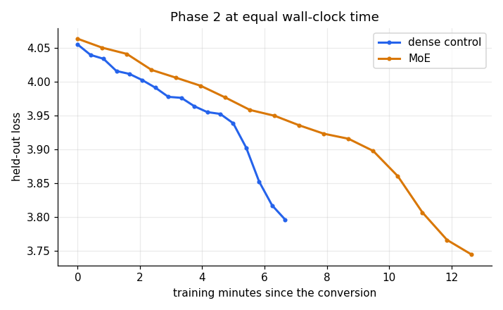
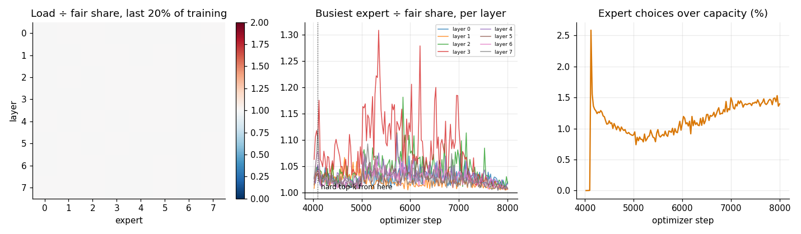

# Session 14: dense → MoE (FineWeb sample-10BT)

Hardware: 1 x TPU v5 lite, bf16 matmuls. Plan: batch 64 x 512, 4000 steps per phase, warm-up 100 steps. This session: 31 min.

| run | params | active | steps | tokens | val start | val end | tok/s | train min |
|---|---:|---:|---:|---:|---:|---:|---:|---:|
| phase 1: dense | 22.2M | 22.2M | 4,000 | 131M | 9.1012 | 4.0554 | 327,978 | 6.7 |
| phase 2: MoE | 71.8M | 29.3M | 4,000 | 131M | 4.0639 | 3.7440 | 172,684 | 12.6 |
| phase 2: dense control | 22.2M | 22.2M | 4,000 | 131M | 4.0554 | 3.7960 | 327,984 | 6.7 |

1. **The conversion was seamless.** Held-out loss 4.0554 for the dense model and 4.0639 for the MoE made from it, before any MoE training (difference +0.0085).
2. **The MoE kept training and kept reducing the loss**: 4.0639 → 3.7440 over 4,000 steps; still falling in the second half of the run (+0.2057).
3. **Against the dense control** (same start, same tokens, same schedule): MoE 3.7440 vs dense 3.7960, the MoE is 0.0520 lower.
4. **Cost**: MoE 172,684 tok/s vs dense 327,984 tok/s (53% of the dense speed), with 29.3M active of 71.8M parameters vs dense 22.2M. To reach the control's final loss (3.7960) the MoE needed 11.9 min of training, against the control's 6.7 min (slower at equal wall-clock).
5. **Experts stayed healthy**: over the last 20% of training the busiest expert took 1.01x its fair share, the quietest 1.00x; 0 of 64 experts were dead (< 10% of fair share); 1.42% of expert choices were over capacity.

